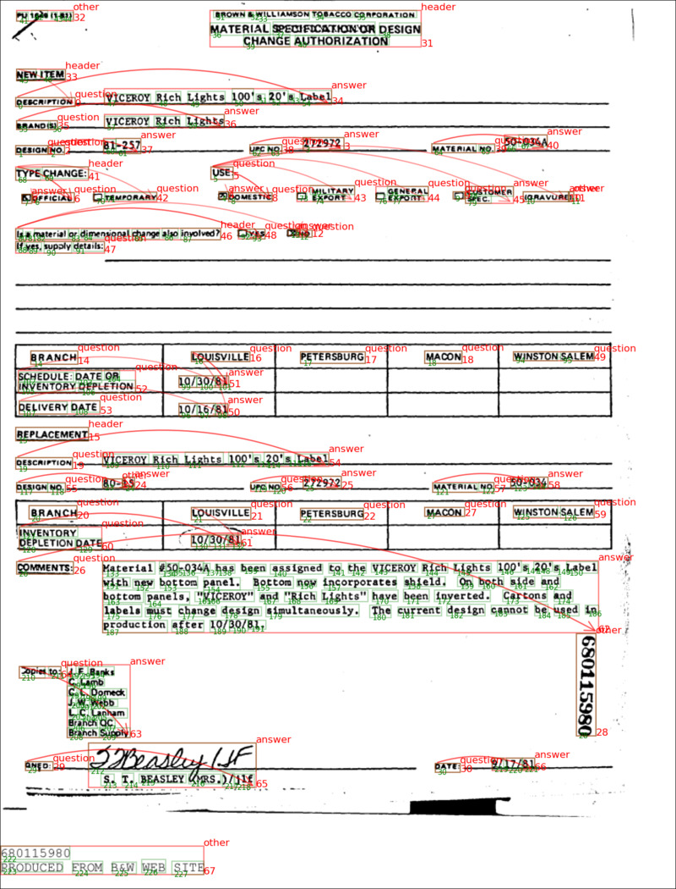

# Project Setup
```bash
git clone git@github.com:jinhopark8345/FUNSD-EDA.git
pip install -e .
pip install -r requirements.txt
```

# (Optional) Prepare dataset
```bash
python3 tools/prepare_funsd_dataset.py
```

# Run FUNSD visualizer
```bash
python3 tools/vis_funsd.py
```

# Visualization examples

### FUNSD sample
[FUNSD Dataset](https://guillaumejaume.github.io/FUNSD/) 


### SROIE sample

