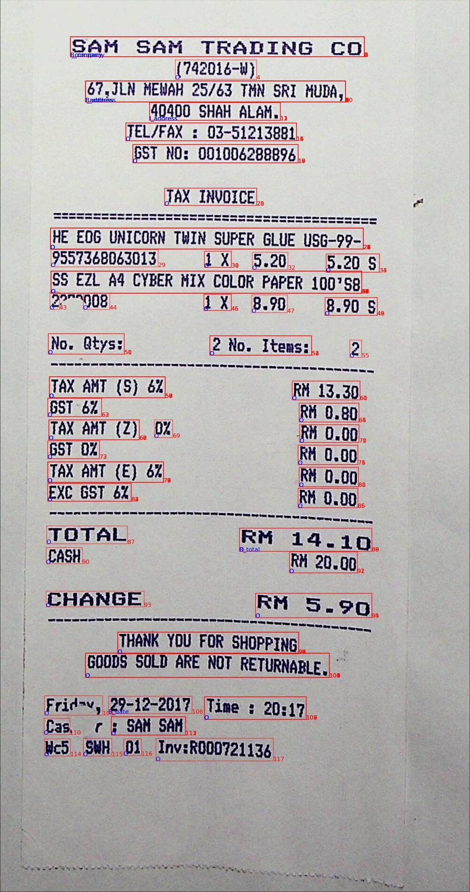

# About [SROIE Dataset](link)


SROIE stands for **Scanned Receipt OCR and Information Extraction**.

### Visualize one sample

*Above image is a visualized sample of SROIE dataset*

From above image,

 - Red boxes : The words(texts) in each of red boxes are the words of one entity
 - Red numbers : entity indices in FUNSD dataset (orders of them)
 - Blue letters : labels of each words
 
Since each word shared entity's box, some labels are overlapped. (like "B_company" and "I_company")

### Find other visualized samples
You can find other visualized samples [here](https://drive.google.com/file/d/1W94OM6HLmMFvZTCtO5bGi-1nxjdtywTx/view?usp=drive_link) 

### If you want to visualize yourself,
```bash
# Run SROIE visualizer
python3 tools/vis_sroie.py
```
